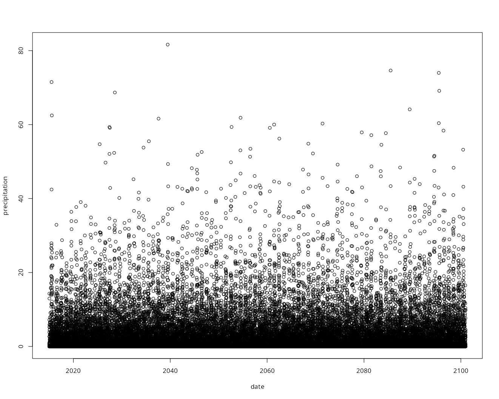

***

```{r setup, include=FALSE}
knitr::opts_chunk$set(eval = TRUE,
                      echo = TRUE,
                      fig.width = 7, 
                      warning = FALSE,
                      message = FALSE)
```

`CMIP6VisR` aims to facilitate handling the downscaled product of CMIP6 projections **SPQM-CMIP6_CAN**. 

This dataset provides high-resolution (0.1°) daily precipitation and temperature projections for Canada, extending to 2100. Bias correction was performed using the Semi-Parametric Quantile Mapping (SPQM) method, ensuring reliable representation of observed marginal properties, trends, and variability while enabling a smooth transition from historical observations to future projections. This dataset includes 693 precipitation simulations from 34 climate models and 581 temperature simulations from 27 models, covering four Shared Socioeconomic Pathways (SSPs). Designed for hydrological, environmental, and ecological research, SPQM-CMIP6-CAN supports risk assessment, planning, and uncertainty quantification in climate impact studies.


<br>
~_Bias-corrected high-resolution temperature and precipitation projections for Canada_ | [Abdelmoaty et al. (2025)](https://www.nature.com/articles/s41597-025-04396-z?)

_"This publication offers the dataset along with an extensive validations on the daily scales. Our validation focuses on two key aspects: temporal and spatial validation. Temporally, we demonstrate the seamless continuity of the SPQM-CMIP6-CAN dataset with observations across all the shared socio-economic pathways (SSPs) of CMIP6, ensuring it preserves the observed distribution while capturing future trends in magnitude and non-stationarity. Spatially, we assess the effects of spatial aggregation on data integrity and visualize precipitation and temperature distributions through regional maps. The dataset remains available at a daily resolution, allowing users to conduct further region-specific validations."_

~_Changes in the risk of extreme temperatures in megacities worldwide_ | [Rajulapati et al. (2022)](https://doi.org/10.1016/j.crm.2022.100433)

_"This publication employed the same bias correction method for daily temperature to investigate future minimum and maximum temperature projections for 199 megacities worldwide. The changes in maximum and minimum temperature are quantified in terms of climate indices (ETCCDI and HDWI) for the four SSPs (SSP1-2.6, SSP2-4.5, SSP3-7.0, and SSP5-8.5)."_

~_Precipitation Bias Correction: A Novel Semi-parametric
Quantile Mapping Method_ | [Rajulapati and Papalexiou (2023)](https://doi.org/10.1029/2023EA002823)

_" This publication refines the bias correction method for daily precipitation by accounting for wet and dry spells is implemented in this publication, showing a case study in the Bow River Basin"_

~_Exacerbated heat in large Canadian cities_ | [Rajulapati et al. (2022)](https://doi.org/10.1016/j.uclim.2022.101097)


_"This publication employes the SPQM-CMIP6-CAN to explore future trends of minimum and maximum temperatures for the 18 most populated Canadian cities."_

~_Changes of Extreme Precipitation in CMIP6 Projections: Should We Use Stationary or Nonstationary Models?_ | [Abdelmoaty et al. (2023)](https://doi.org/10.1175/JCLI-D-22-0467.1)


_"This publication employes the same methods for bias correctiong daily precipitation to explore future extreme precipitation and their non-stationarity globally"_

***
# Step by step guide to facilitate employing SPQM-CMIP6-CAN {#section_1}

Install packages 
```{r, warning=FALSE, message=FALSE}
library(CMIP6VisR)
library(terra)
```


## Download the required simulation

Each simulation is divided into nine zones to facilitate efficient computational processing. As a first step, users must determine which zone(s) their shapefile intersects with to ensure they download the correct simulation data.


To know which zones are included in the targeted region, refer to the following chunk:

```{r warning=FALSE}
# convert the dataframe of zones to raster (built-in the package)
zone_area_grid <- cv_zone_area_raster() 


# Read the required shapefile
fpath <- system.file("extdata", "07BF001.shp", package = "CMIP6VisR")
basin_vector <- vect(fpath)


req_data <- cv_clip_basin(zone_area_grid, basin_vector)


# printing the zones that are required for the targeted area
print(req_data[["zone"]])
```


The command `cv_clip_basin` returns rasters of the cell areas for each zone
which your basin overlaps. The individual rasters are plotted for each zone
and together.

```{r message=FALSE, warning=FALSE}
# Isolating the raster outputs
raster_list <- req_data$raster

terra::plot(raster_list[[1]], main = expression("Zone 4, Grid Areas in " ~ km^2))

terra::plot(raster_list[[2]], main = expression("Zone 7, Grid Areas in " ~ km^2))

# Merge the individual rasters using terra::merge
merged_raster <- do.call(terra::merge, req_data$raster)

# Plot the merged raster
terra::plot(merged_raster, main = expression("All zones, Grid Areas in " ~ km^2))

```


Once the relevant zone(s) are identified, users can proceed to download the required simulations, selecting the appropriate climate model and future scenario. These files can be accessed and downloaded locally via the FRDR portal: <https://www.frdr-dfdr.ca/repo/dataset/7a02a1e0-3402-4183-af41-dfa483ef06b1>. Note that all the files
are NetCDF files. 

Alternatively, users have the option to leverage Globus Data Transfer for downloading files directly through the FRDR portal, providing a seamless transfer of large datasets to local directories or HPCs. Users will need to set up their own Globus account. More information about Globus is available at <https://www.globus.org/>.


## Get the data within the required shapefile

The function `cv_basin_daily_precip` has several parameters:
1. *netcdf_directory*: the path of the saved NC files downloaded from the FRDR portal.
2. *scenario* the scenario argument which indicates the name of the simulation (the part of the string that is before the zone number). For example: "pr_day_ACCESS-CM2_ssp126_r2i1p1f1_gn_20150101-21001231_cannc_SPQM_"
3. *basin_zone_area*: the output resulting from `cv_clip_basin` getting the grid area information of the target basin. 
4. *temp_file*: if `FALSE` (the default), the function tries to complete all operations in memory, 
which is relatively fast. However, if you are using a very large basin, then you might run of memory.
In this case, you need to specify `temp_file = TRUE`.

The function uses the areas for each cell to weight the precipitation from the NetCDF file(s).

```{r, eval=FALSE}
values <- cv_basin_daily_precip(netcdf_directory = "./data/",
                                scenario = "pr_day_ACCESS-CM2_ssp126_r2i1p1f1_gn_20150101-21001231_cannc_SPQM_",
                                basin_zone_area = req_data,
                                temp_file = FALSE)
```


Plot the basin daily precipitation values

```{r, eval=FALSE}
plot(values)
```


